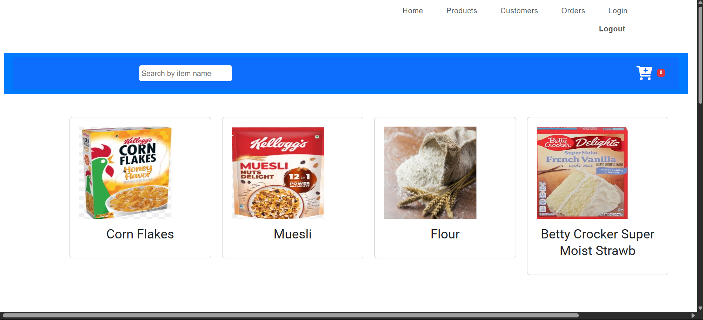
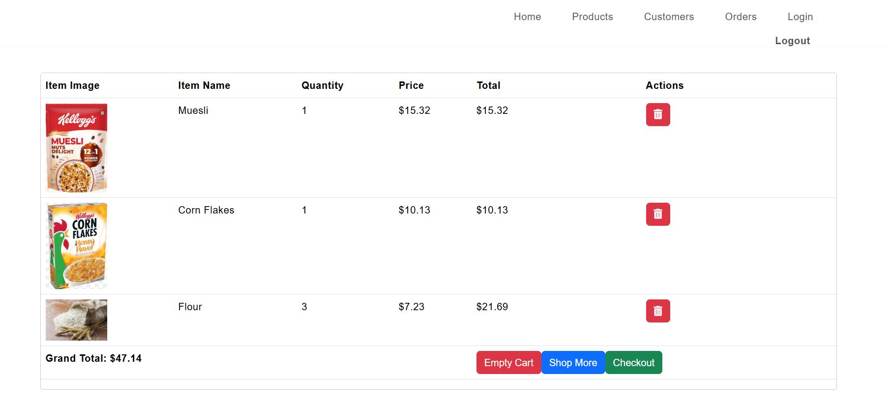

# 🛒 E-Commerce Angular Application

[](https://angular.io/)
[](https://www.typescriptlang.org/)

A responsive single-page e-commerce web application built with **Angular** and **TypeScript**. Designed with modern frontend architecture patterns, state management best practices, and modular design principles to deliver a seamless shopping experience.

---

## 📸 Visual Overview

| Product Catalog & Filtering | Interactive Cart & Checkout |
| :-------------------------: | :-------------------------: |
|  |  |

---

## ⚡ Key Features

* **Product Catalog & Dynamic Filtering:** Real-time filtering by category and search queries with client-side/server-side state synchronization.
* **State-Driven Shopping Cart:** Real-time recalculations for item counts, subtotals, taxes, and shipping logic.
* **Streamlined Checkout Flow:** Form validation and multi-step user experience optimized for conversion.
* **Fully Responsive UI:** Built ground-up for mobile, tablet, and desktop viewports using CSS layout standards (Flexbox/Grid).
* **Modular Architecture:** Core, shared, and feature modules/components structured to ensure maintainability and lazy loading capability.

---

## 🛠️ Architecture & Tech Stack

* **Frontend Framework:** Angular
* **Language:** TypeScript
* **Styling:** Modular CSS / HTML5
* **Package Manager:** npm

### Architectural Highlights
* **Component-Driven Design:** Clear separation of smart (container) and dumb (presentational) components to promote reusability and testability.
* **Reactive State Management:** Leverages RxJS Observables to handle asynchronous data streams and UI state updates efficiently.
* **REST API Integration:** Service-layer abstraction using Angular's `HttpClient` to isolate data fetching from UI presentation.

---

## 🚀 Getting Started

### Prerequisites
Make sure you have Node.js and npm installed globally on your machine.
* [Node.js](https://nodejs.org/) (v18.x or higher)
* [Angular CLI](https://angular.io/cli) (`npm install -g @angular/cli`)

### Installation

Build Ecommerce_Angular from the source and install dependencies:

1. **Clone the repository:**

    ```sh
    ❯ git clone https://github.com/Odeh182003/Ecommerce_Angular
    ```

2. **Navigate to the project directory:**

    ```sh
    ❯ cd Ecommerce_Angular
    ```

3. **Install the dependencies:**

**Using [npm](https://www.npmjs.com/):**

```sh
❯ npm install
```

### Usage

Run the project with:

**Using [npm](https://www.npmjs.com/):**

```sh
npm start
```

### Testing

Ecommerce_angular uses the {__test_framework__} test framework. Run the test suite with:

**Using [npm](https://www.npmjs.com/):**

```sh
npm test
```

---

<div align="left"><a href="#top">⬆ Return</a></div>

---
